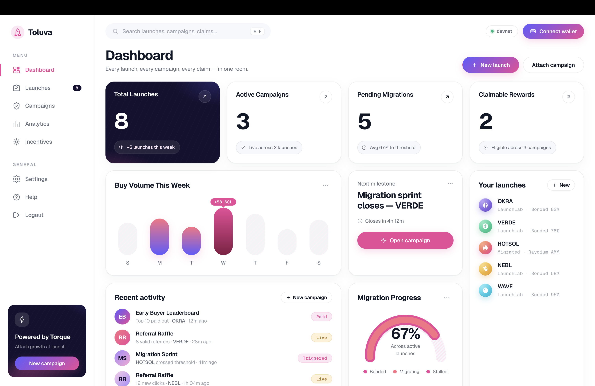

# Toluva



Incentive-native LaunchLab platform for token launches with Torque campaigns attached from day one.

## Current State

This repo is a Vite React app with:

- landing page and dashboard UI;
- a file-backed registry at `data/launch-registry.json`;
- a small local API at `server/index.js`;
- a frontend registry facade at `src/lib/launchRegistry.js` that reads the API and falls back to the local seed;
- injected Solana wallet detection with a demo-wallet fallback;
- backend integration status/prep routes for Torque, Solana RPC, and Raydium LaunchLab;
- placeholder data shaped for LaunchLab launches, Torque campaigns, live events, and analytics.

Torque event emission is wired behind the local API. Without a Torque API key, events are recorded locally as `torque_skipped`; with `TORQUE_EVENT_API_KEY` or `TORQUE_API_KEY`, the backend posts custom events to the configured Torque ingest URL and stores the receipt.

Raydium LaunchLab transaction building is staged behind prep/status routes. The next phase is adding the Raydium SDK dependencies and wallet-signed transaction flow on devnet.

## Run Locally

```bash
npm install
npm run dev
```

Then open the local Vite URL, usually `http://localhost:5173`.

Run API and web together:

```bash
npm run dev:all
```

Run only the API:

```bash
npm run api
```

API docs live in `docs/api.md`.
Torque MCP setup notes live in `docs/torque-mcp-runbook.md`.

## Build

```bash
npm run build
```

## Deploy Frontend

The app is a Vite SPA. `vercel.json` rewrites client routes such as `/dashboard`, `/launches`, and `/campaigns` back to `index.html` so direct refreshes do not 404.

Vercel settings:

- Framework preset: `Vite`
- Install command: `npm install`
- Build command: `npm run build`
- Output directory: `dist`

## Integration Targets

- Raydium LaunchLab devnet token launch flow.
- Launch registry persisted by backend storage.
- Torque custom event emission.
- Torque recurring incentive creation.
- Public launch page with leaderboard and claim status.
- Friction log for Torque/Raydium docs and API gaps.
