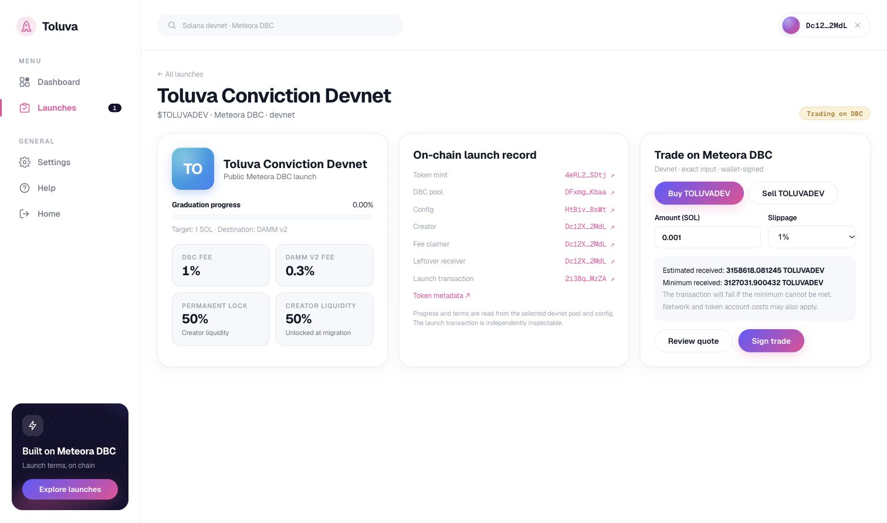

# Meteora DBC integration friction

These are issues encountered during the Toluva devnet build and normal wallet flow. The older Raydium/Torque [friction log](friction-log.md) belongs to the prior project.

## Confirmed config read blocked pool construction

- **Symptom:** After the creator signed a valid DBC config, pool construction failed with `Cannot read properties of undefined (reading 'poolFeeBps')`.
- **Root cause:** The SDK's config builder input has a nested `migratedPoolFee`, while the decoded on-chain `PoolConfig` exposes `migratedPoolFeeBps` at the top level. Our reader reused the builder shape for the on-chain account.
- **Resolution:** Decode and verify the on-chain shape explicitly before building the pool. Preserve the confirmed config and resume with a new mint signer. The pool transaction subsequently simulated and was confirmed. The [confirmed account fixture](../tests/fixtures/devnet-conviction-config.json) guards this mapping.

## Live pool status failed before the first trade

- **Symptom:** The token page briefly showed `Live pool state is unavailable: fetch failed` and stopped displaying fresh graduation progress.
- **Root cause:** The API was running, but its Solana devnet RPC connection was refused. On the development machine, the system resolver returned `64.130.42.134` for `api.devnet.solana.com`; independent resolvers returned `208.115.212.49`, which answered the same RPC health request over HTTPS. Other websites were reachable. This was a local DNS resolution failure, not a missing pool or failed launch.
- **Local resolution:** The Wi-Fi DNS servers were set to `8.8.8.8` and `1.1.1.1`. The API then read the same confirmed pool and quoted the buy again.
- **Product behavior:** A failed read now carries the last verified pool state with a stale marker and timestamp. The page pauses trading, discards a previously reviewed quote, explains the RPC outage, and offers a retry. A separate API outage preserves the last loaded registry instead of replacing the user's launches with static fallback data. Fresh chain data is required before trading resumes.
- **Validation:** An isolated RPC fault test served a fresh pool state, then severed the RPC connection. The API returned the previous state with `liveStale: true`, a preserved `liveCheckedAt`, and a clear retry message. After restoring connectivity, the real devnet pool and buy quote returned successfully.

The first wallet-signed DBC trade remains separate evidence in the [proof record](meteora-proof.md).
