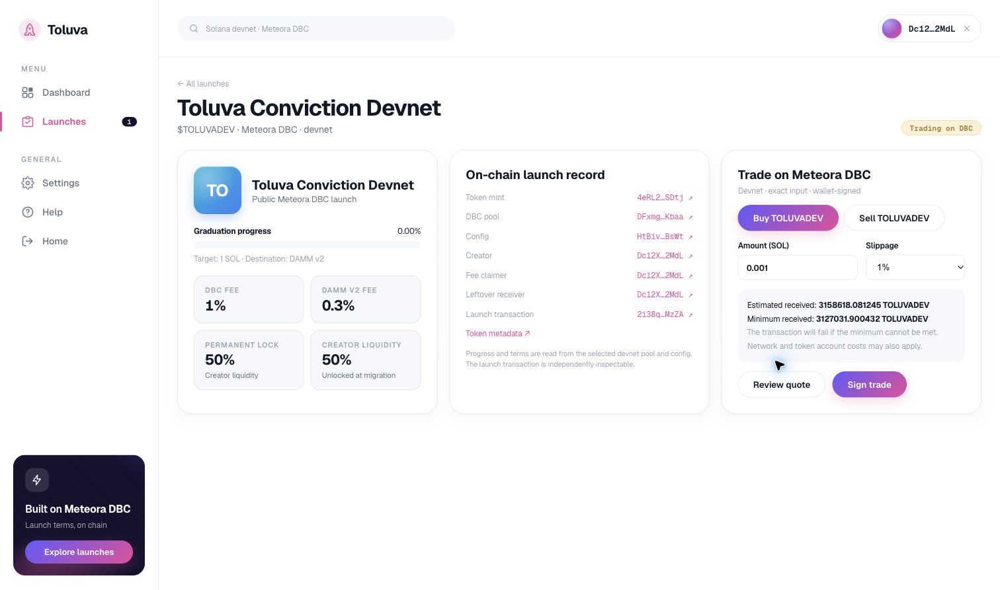
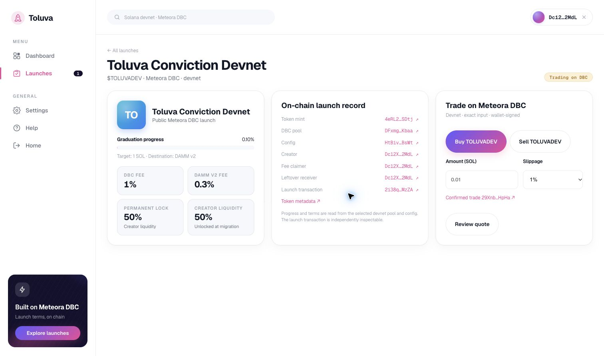
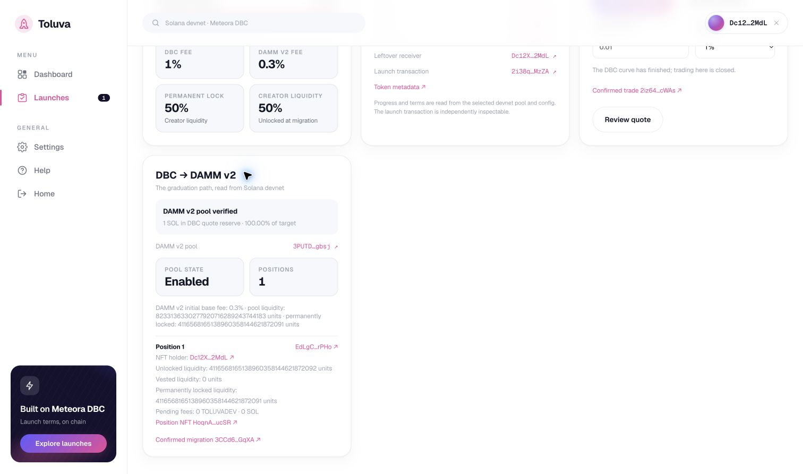

# Toluva Conviction devnet proof

This records the first Toluva-owned Meteora DBC pilot launched through the ordinary creator UI. A step is marked complete only after on-chain confirmation. The prior Raydium/Torque proof is separate.

## Pilot identity

- Name: Toluva Conviction Devnet
- Symbol: `TOLUVADEV`
- Network: Solana devnet
- [Public token metadata](https://cdn.jsdelivr.net/gh/Pavilion-devs/toluva-torque@8bc0ef6b6bce0dc4f3e46a28e7288d593524e796/public/metadata/toluva-conviction-devnet.json)
- Recipe: Conviction v1, SOL quote, 1 SOL migration threshold, 1% DBC fee, 0.3% DAMM v2 fee, 50% of migrated creator liquidity permanently locked

## Confirmed config

- Creator/fee claimer/leftover receiver: `Dc12XGCWDcnxpjDsYuz89vFqYJ4YHxYb3dvGFBC22MdL`
- [DBC config](https://explorer.solana.com/address/HtBivi8K1mfroTVMZWGA4bg6uXuBo4c61KJ3mQGXBsWt?cluster=devnet): `HtBivi8K1mfroTVMZWGA4bg6uXuBo4c61KJ3mQGXBsWt`
- [Confirmed createConfig transaction](https://explorer.solana.com/tx/534UTyVGR1LbCtiP5PThtHAEJ5cZnvu7y7LrymsFYTw6fPPy6L2reZMewgqmZbHvF9HtkxRDpAQXHiiUFPZt4iEb?cluster=devnet): `534UTyVGR1LbCtiP5PThtHAEJ5cZnvu7y7LrymsFYTw6fPPy6L2reZMewgqmZbHvF9HtkxRDpAQXHiiUFPZt4iEb`
- The SDK decoded the confirmed config with a 1,000,000,000 lamport threshold, 6 token decimals, fixed supply, immutable token authority, 100 bps DBC fee, 30 bps migrated-pool fee, and the 50/50 creator liquidity split.
- The exact on-chain account bytes are stored as a [regression fixture](../tests/fixtures/devnet-conviction-config.json). The verifier compares the account against the recipe before pool creation.

## Confirmed pool and mint

- [Token mint](https://explorer.solana.com/address/4eRL2sk1EUdAi3YuBDfqT2xx46X5WFpN7N3xmN9QSDtj?cluster=devnet): `4eRL2sk1EUdAi3YuBDfqT2xx46X5WFpN7N3xmN9QSDtj`
- [DBC pool](https://explorer.solana.com/address/DFxmgj3i6rRsf1p13FxuvKELZ3Ktk5MVGLNcKPu8Kbaa?cluster=devnet): `DFxmgj3i6rRsf1p13FxuvKELZ3Ktk5MVGLNcKPu8Kbaa`
- [Confirmed pool transaction](https://explorer.solana.com/tx/2i38qMtv5ziBBvrTTEXxyDPz4EP8Q5zjqxBxrgN7mJWq7CFU1VjqKLrSyrUv3Cg83K1WN95EDX5vyUCVbuTwMzZA?cluster=devnet): `2i38qMtv5ziBBvrTTEXxyDPz4EP8Q5zjqxBxrgN7mJWq7CFU1VjqKLrSyrUv3Cg83K1WN95EDX5vyUCVbuTwMzZA`
- The verifier checked the pool PDA, its on-chain config/mint/creator relationship, creator and mint signatures, and the `initializeVirtualPoolWithSplToken` instruction in that transaction. The instruction metadata matches the name, symbol and URI above.
- Before the first trade, an on-chain status read showed bonding state, zero quote reserve, zero migration progress and 0.00% of the 1 SOL threshold. A read-only exact-input quote for a 0.001 SOL buy returned successfully.
- An unsigned 0.001 SOL buy built for the connected wallet simulated on devnet with no error (46,941 compute units) before wallet signing.
- The public Toluva launch page displays the mint, pool, config, creator, fees, migration target, lock terms, live progress and explorer links. It is currently served by the local development app; this record does not claim that `toluva.xyz` hosts the new build.

## Confirmed first buy

- [Finalized DBC buy transaction](https://explorer.solana.com/tx/29XnbAi5CexW8zEJMZ9KGedCrhf8Mmv3i5Pvffwebfdv6ZvjYmcUUjN1NaJY2dbZbHANwby3eUNeZSVrksuUHpHa?cluster=devnet): `29XnbAi5CexW8zEJMZ9KGedCrhf8Mmv3i5Pvffwebfdv6ZvjYmcUUjN1NaJY2dbZbHANwby3eUNeZSVrksuUHpHa`
- The connected creator wallet `Dc12XGCWDcnxpjDsYuz89vFqYJ4YHxYb3dvGFBC22MdL` signed the transaction. It succeeded at slot `508861735` with no transaction error and invoked the Meteora DBC program against this pool and mint.
- The pool received `0.001` SOL in its quote token account. The wallet's TOLUVADEV token account received `3,158,618.081245` tokens, exactly matching the reviewed output. The transaction fee was `80,000` lamports; token-account creation and other network costs can also affect the wallet's SOL balance.
- A fresh pool read showed `990,000` quote-reserve lamports after fees, `0.10%` graduation progress and migration progress `0` (still bonding). This is buy execution evidence, not graduation evidence.

## Confirmed graduation buy

- The normal trade UI reviewed a `1.009101011` SOL buy. Its unsigned transaction simulated without error, with a predicted post-trade DBC quote reserve of exactly `1,000,000,000` lamports. The reviewed quote is captured in [graduation-quote-review.png](graduation-quote-review.png).
- The connected wallet signed the [graduation buy transaction](https://explorer.solana.com/tx/2iz64DoQaUkCTRcGKrsgs7Wkgw2NfQYQdjfAPfNPynfZ9zfVQDNr47qntLju9597C2hRW6aZx2ba47TvuAMRcWAs?cluster=devnet): `2iz64DoQaUkCTRcGKrsgs7Wkgw2NfQYQdjfAPfNPynfZ9zfVQDNr47qntLju9597C2hRW6aZx2ba47TvuAMRcWAs`. It finalized at slot `508902782` without an error.
- A fresh chain read showed the 1 SOL threshold reached, `100.00%` progress and migration progress `2` (`LockedVesting`). DBC trading closed while DAMM v2 migration was pending. These are observed post-transaction states, not simulation claims.

## Confirmed DAMM v2 migration

- The wallet-signed [migration transaction](https://explorer.solana.com/tx/3CCd61o97tHar7LJV8A8pCxYceR9H3GA6JGjruC3kNx9tw6QSUcqAjUnL6c6uS9WkYJ1bxmkibUJSW3Y6WXBGqXA?cluster=devnet): `3CCd61o97tHar7LJV8A8pCxYceR9H3GA6JGjruC3kNx9tw6QSUcqAjUnL6c6uS9WkYJ1bxmkibUJSW3Y6WXBGqXA` finalized at slot `508927655` without an error.
- The derived [DAMM v2 pool](https://explorer.solana.com/address/3PUTDKRphNrbXw8MtVa1HvFBGek2fS6NEDM1tyZogbsj?cluster=devnet) `3PUTDKRphNrbXw8MtVa1HvFBGek2fS6NEDM1tyZogbsj` exists on devnet under the DAMM v2 program. Toluva's chain reader verifies it is enabled and reads the configured `0.3%` initial base fee.
- The chain reader found [position](https://explorer.solana.com/address/EdLgChkFkJoCQNVMdmxTMG6M6o5kcAd1KQwzxjRNrPHo?cluster=devnet) `EdLgChkFkJoCQNVMdmxTMG6M6o5kcAd1KQwzxjRNrPHo`, whose [NFT](https://explorer.solana.com/address/HoqnASbSjhXEfW6v8U5KT6RdSZ8471UR2qmXY4CuucSR?cluster=devnet) is held by creator wallet `Dc12XGCWDcnxpjDsYuz89vFqYJ4YHxYb3dvGFBC22MdL`. The position reports `4116568165138960358144621872092` unlocked liquidity units and `4116568165138960358144621872091` permanently locked units, matching the recipe's 50/50 split to integer rounding. These are DAMM liquidity units, not token or SOL amounts.
- Before the user signed, the migration transaction was built for this pool and simulated on devnet without an error (`144,370` compute units). The migration UI now displays the verified successor pool, position owner, lock state and confirmed transaction through the ordinary token page.

## Next evidence

- Both pilot buy signatures independently pass Toluva's finalized DBC swap verifier. It checks the DBC `swap2` instruction, exact pool and mint, signer, and opposing wallet/pool token balance changes. The public page now reports **2 verified buys by 1 tracked buyer**, each linked to its transaction. Re-submitting the same signature leaves the event count at two. The devnet RPC returned the first buy by direct signature lookup while omitting it from that pool's address-history listing, so Toluva records verified submitted signatures and does not present its count as a complete chain index.
- Wallet-signed DBC sell on a still-active curve: pending. This graduated pool has closed DBC trading, so that check requires another ordinary launch or an independent active pool.
- Independent creator reproduction, general-purpose metadata hosting, published campaign eligibility and funded reward claim: pending.

The first pool build attempt exposed a schema mapping error: the SDK builder accepts nested `migratedPoolFee`, while decoded on-chain `PoolConfig` stores `migratedPoolFeeBps` at the top level. The confirmed config was unaffected. The reader now uses the on-chain field, and an unsigned pool transaction using this config passed devnet simulation before the successful wallet-signed launch.
